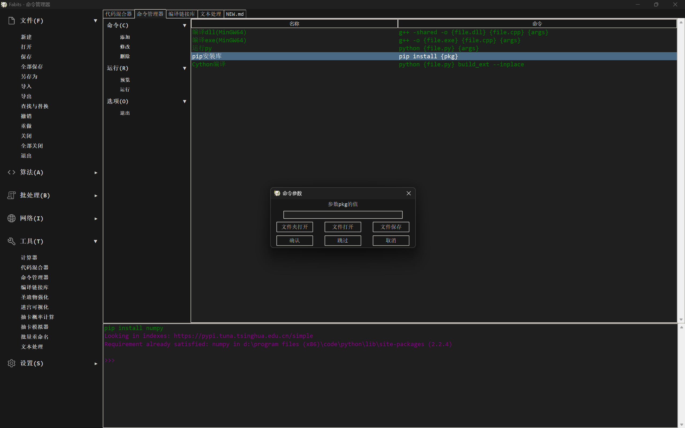

# Fabits（Python / Tkinter）


[](https://github.com/Deiloproxide/Fabits/releases)

Algorithm, file, batch toolbox application build by built-in Tkinter frame in Python, Integrated many functions ([中文文档](/README_zh.md))


## Feature
- Modern Text Editor with multitabs, undo, redo and search
- Two well-designed UI (day mode and Night mode)
- User configure storage in Json
- Origin dynamic widgets
- Calculator for science or program
- Files process with OS
- Command tools for programmer

## Datas
- Fabits data store in `Json/`
- `Data.json` is read-only, used for database, your modify will be displayed directly in application
- `Config.json` is managed by program, you needn't manage it manually except add a lot of commands

## Requirements
- Require below packages
```
chardet
numpy
pillow
requests
```

## Build from Source
1.Install Python (All the releases were built in Python 3.13.2 but not found features linked to special version yet)

2.Pip install
```bash
pip install chardet numpy pillow requests
```
3.Git clone
- (1)Build by Pyinstaller
```bash
pip install pyinstaller
git clone https://github.com/Deiloproxide/Fabits.git
cd Fabits/FabitsSetup
.\Pyinstaller_Build.bat
```
- (2)Build by Nuitka
  - Install MSVC or GCC, then run:
```bash
pip install nuitka
git clone https://github.com/Deiloproxide/Fabits.git
cd Fabits/FabitsSetup
.\Nuitka_Build.bat
```

## Contributing

Your contibutions are well-welcome! Please feel free to make comments or submit a pull request
## Contact

Deiloproxide - [@Deiloproxide](https://github.com/Deiloproxide)

Project link: [https://github.com/Deiloproxide/Fabits](https://github.com/Deiloproxide/Fabits)

Detailed helps [here](Help.md)

New update [here](NEW.md)
```cpp
#include<stdio.h>
int main(){
    char Luv[]="I love Nahida";
    printf("%s",Luv);
    return 0;
}
```


