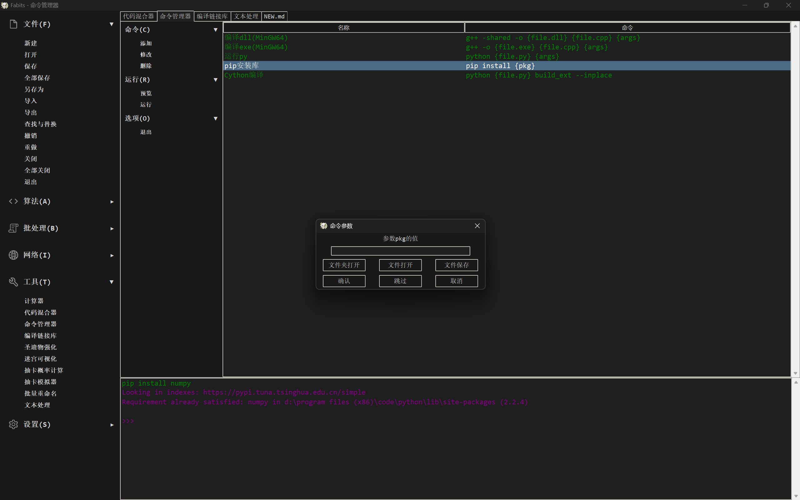

# Fabits（Python / Tkinter）


[](https://github.com/Deiloproxide/Fabits/releases)

一个使用 Python Tkinter 框架构建的算法，文件，工具箱应用，集成了很多小功能（English Documentation [Here](/README.md)）


## 特点
- 多页面现代风格文本编辑器，支持重做，撤销，查找与替换
- 两套精美设计 UI (白天模式和夜间模式)
- 用户配置静态存储在 Json 中
- 原创动态组件
- 科学计算器和程序计算器
- 系统级别文件交互批处理
- 程序员专属命令行工具

## 数据存储
- Fabits 应用数据存储于目录 `Json/` 下
- `Data.json` 用于只读数据库，可直接修改程序的各项参数
- `Config.json` 可被程序读写，除非需要大量添加命令，否则不必手动改写

## 依赖
- 需要安装以下库：
```
chardet
numpy
pillow
requests
```

## 从源码编译
1.安装 Python（所有二进制文件均在 Python 3.13.2 环境下编译，不过目前尚未发现与特定版本有关的特性依赖）

2.Pip 安装
```bash
pip install chardet numpy pillow requests
```
3.Git 克隆
- (1)使用 Pyinstaller 编译
```bash
pip install pyinstaller
git clone https://github.com/Deiloproxide/Fabits.git
cd Fabits/FabitsSetup
.\Pyinstaller_Build.bat
```
- (2)使用 Nuitka 编译
  - 需要先安装 MSVC 或 GCC 编译器，然后运行:
```bash
pip install nuitka
git clone https://github.com/Deiloproxide/Fabits.git
cd Fabits/FabitsSetup
.\Nuitka_Build.bat
```

## 贡献

我们欢迎您对我们项目的贡献，请随时评价项目或提交代码
## 联系我们

Deiloproxide - [@Deiloproxide](https://github.com/Deiloproxide)

项目链接: [https://github.com/Deiloproxide/Fabits](https://github.com/Deiloproxide/Fabits)

[详细帮助](Help.md)

[新特性](NEW.md)
```cpp
#include<stdio.h>
int main(){
    char Luv[]="I love Nahida";
    printf("%s",Luv);
    return 0;
}
```


